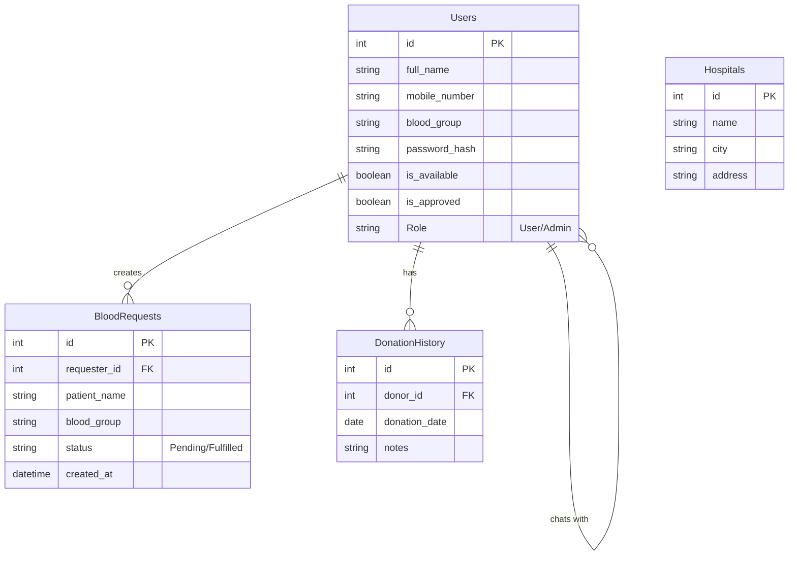
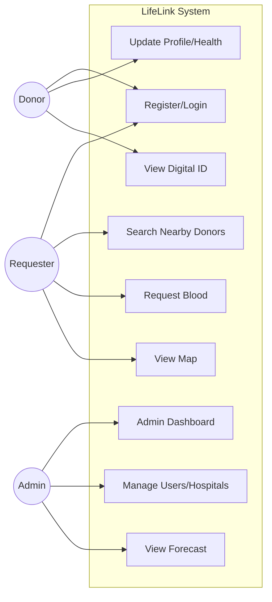

# LifeLink – Smart Blood Donation Management System
## Final Year Project Documentation

### 1. Project Abstract
**LifeLink** is a comprehensive, web-based platform designed to bridge the gap between blood donors and recipients. Utilizing the **Flask** framework and **SQLite** database, the system provides a real-time, location-based solution to blood shortages. Key features include **AI-driven donor ranking** to identify the most suitable donors, a **geo-location map** (Leaflet.js) to visualize nearby donors, and an **Admin Dashboard** with predictive analytics (Chart.js) to forecast blood demand. The system ensures security through password hashing and role-based access control, making it a robust, production-ready application for modern healthcare needs.

### 2. System Architecture
```mermaid
graph TD
    User[User/Donor] -->|HTTPS| Web[Web Interface (HTML/CSS/JS)]
    Admin[Administrator] -->|HTTPS| Web
    Web -->|Requests| App[Flask Application Server]
    App -->|ORM| DB[(SQLite Database)]
    App -->|Compute| AI[AI Matching & Forecast Engine]
    Web -->|Maps API| Leaflet[OpenStreetMap/Leaflet]
    App -->|Generate| QR[QR Code Generator]
```

### 3. Entity Relationship Diagram (ERD)


### 4. Use Case Diagram


### 5. Viva Explanation & Questions

**Q1: What is the core technology stack?**
**A:** The frontend uses HTML5, CSS3, and JavaScript (Leaflet.js, Chart.js). The backend is built on Python Flask. The database is SQLite (scalable to MySQL).

**Q2: How does the AI Matching work?**
**A:** The system calculates a `match_score` based on:
1.  **Blood Type**: Exact match gets higher score, compatible types get lower.
2.  **Distance**: Donors closer to the hospital get a boost.
3.  **Recency**: Donors who haven't donated in a long time (rested) are preferred.

**Q3: How is security handled?**
**A:** Passwords are never stored in plain text; we use `werkzeug.security.generate_password_hash` with SHA-256. Routes are protected using `@login_required` decorators, and Admin routes have an additional role check.

**Q4: Why usage of Leaflet instead of Google Maps?**
**A:** Leaflet combined with OpenStreetMap provides a robust, cost-effective (free) solution for geo-spatial visualization without requiring an API key or credit card, making it ideal for open-source and student projects while offering similar functionality.
